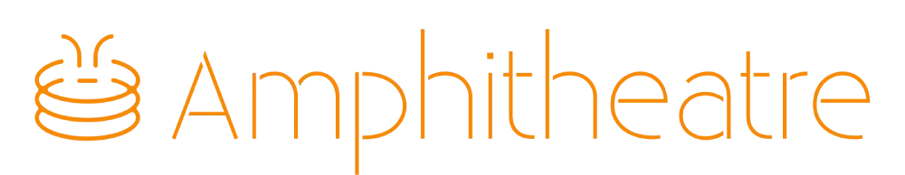

<div align="center">



<br />

[](LICENSE)
[](https://hub.docker.com/r/simstosh/amphitheatre)
[](https://livekit.io)
[](https://github.com/OvenMediaLabs/OvenMediaEngine)

A private online room for you and your friends: text chat, voice, camera, screen share, and — if you want — everyone watching the same live stream together. No sign-up, no ads, and you own the server it runs on.

</div>

## Contents

- [What is Amphitheatre?](#what-is-amphitheatre)
- [What you get](#what-you-get)
- [How do I run it?](#how-do-i-run-it)
- [Documentation](#documentation)
- [How to Contribute](#how-to-contribute)
- [License](#license)

## What is Amphitheatre?

Think of it as your own small, private version of a Discord voice channel with a shared screen — except it also has a "cinema mode": if you want, one person can broadcast from OBS and everyone else watches that exact same live video together, in sync.

Rooms are temporary (nobody keeps a permanent account) and there is nothing to install for your friends — they just open a link in the browser, type a name, and join.

A few things it is **not**: it is not Netflix, and it does not include or endorse streaming someone else's paid content — the "broadcast" feature is a generic tool, the same way OBS or Zoom screen share are generic tools. It also does not record anything: once a call ends, it is gone, by design.

## What you get

- **No accounts.** Pick a display name and you're in. Your role (owner, admin, member...) is remembered if you come back to the same room.
- **Text chat, voice, camera, and screen share**, built on [LiveKit](https://livekit.io) (the same open-source technology behind many video products).
- **An optional "watch together" stage** — one person streams from OBS, Twitch, YouTube, Kick, or any URL, and it plays for everyone in the room, off by default.
- **Moderation that just works**: kick, mute, ban, and a password lock that temporarily blocks someone after 3 wrong guesses.
- **Works well on phones**, not just desktop — the mobile layout is designed on its own, not a squeezed-down desktop view.
- **Available in English, Portuguese, and Spanish.**

## How do I run it?

There are two very different audiences here, so pick the one that matches you:

### "I just want to use it — I'm not a developer"

You don't need to download the source code or write any code. Grab the small `deploy/` folder from this repository (or clone the whole thing, that also works), point a domain at your server, and start it with Docker:

```bash
git clone https://github.com/simstm/amphitheatre.git
cd amphitheatre/deploy
cp env.example .env    # fill in your domain and a couple of secrets
docker compose --profile caddy up -d
```

That downloads ready-made images from [Docker Hub](https://hub.docker.com/r/simstosh/amphitheatre) — nothing is compiled on your machine. Full step-by-step guide, including how to use Traefik instead of the built-in reverse proxy, and which firewall ports you need to open: **[Self-hosting guide](docs/self-hosting.md)**.

Just kicking the tires on your own computer? A single command gets the app itself running (though voice/video needs the LiveKit piece too — see the guide):

```bash
docker run -p 3001:3001 -e SESSION_SECRET=change-me simstosh/amphitheatre:latest
```

### "I want to change the code / contribute"

Now you do want the full repository, plus Bun and pnpm on your machine. See **[Getting started](docs/getting-started.md)** for the developer setup:

```bash
pnpm install
cp .env.example .env
cp apps/api/.env.example apps/api/.env
make up      # starts the voice/video engine locally
pnpm dev     # starts the app itself
```

## Documentation

| Guide | Covers |
|---|---|
| [Self-hosting](docs/self-hosting.md) | Run your own copy: domains, `deploy/`, Caddy or Traefik, ports, updates |
| [Getting started](docs/getting-started.md) | Developer setup, `make up` / `make ome-up`, smoke checks |
| [Configuration](docs/configuration.md) | Every environment variable, explained |
| [HTTP / WebSocket API](docs/api.md) | Frozen contract |
| [Identity and moderation](docs/identity.md) | Guests, roles, bans, lockout |
| [Broadcast and OBS](docs/broadcast.md) | Opt-in stage, stream key, OvenPlayer |
| [Architecture](docs/architecture.md) | Monorepo, stores, OME independence |
| [License and CLA](docs/license.md) | Why AGPL, ICLA, dual-license |
| [Infrastructure](infra/README.md) | Local dev Compose, UDP/TLS ports |
| [Load testing](docs/load-testing.md) | Capacity; recording is forbidden |
| [CHANGELOG](CHANGELOG.md) | What changed in each version |
| [AGENTS.md](AGENTS.md) | Instructions for coding agents |
| [Design](apps/web/DESIGN.md) | SPA tokens |

## How to Contribute

Thank you for contributing. See [CONTRIBUTING.md](CONTRIBUTING.md) for setup, tests, and the pull-request flow.

Pull requests need the [Individual Contributor License Agreement](CLA.md). The CLA Assistant bot comments on the PR with the signature sentence.

## License

Amphitheatre is licensed under [AGPL-3.0-only](LICENSE), copyright [SIMSDEV](https://sims.dev.br).

The public tree stays AGPL so anyone who hosts a modified version as a network service must offer the corresponding source. SIMSDEV may dual-license contributions (including a future paid hosted offering) through the [ICLA](CLA.md). Details: [License and CLA](docs/license.md).
